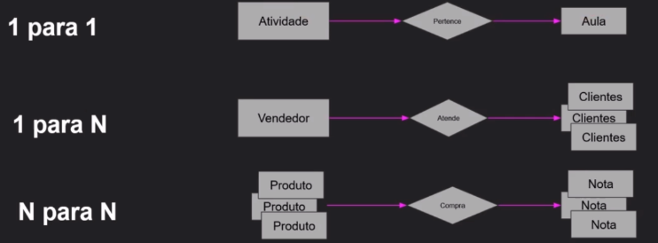

<h1 align="center">Formação Node.js 💻</h1>

<h2 align="center">  
  
  :memo:
  
  Blog com painel administrativo - CRUD completo feito em Node.js
</h2>

## Tecnologias

### **Front-end**

- HTML
- CSS
- Bootstrap
- TinyMCE

## **Back-end**

- Node.js
- Express
- MySQL
- Sequelize
- EJS
- Slugify
- Bcryptjs
- Cookies e sessões
- Middlewares

---

## Repositório

> https://github.com/comicodarko/NodeBlog

---

### Estudo

## Relacionamentos

É um conceito importante em banco de dados **relacionais**. É uma **associação ou dependência** entre uma ou mais tabelas.

- Uma **música** na tabela de músicas depende de uma **banda** da tabela de bandas.
- Uma **categoria** tem vários **artigos**.

;
